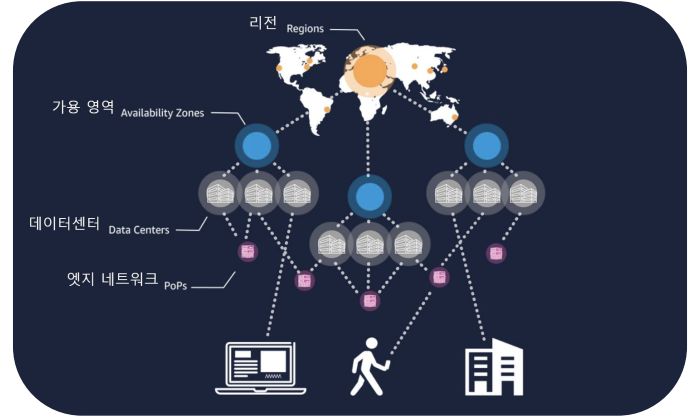
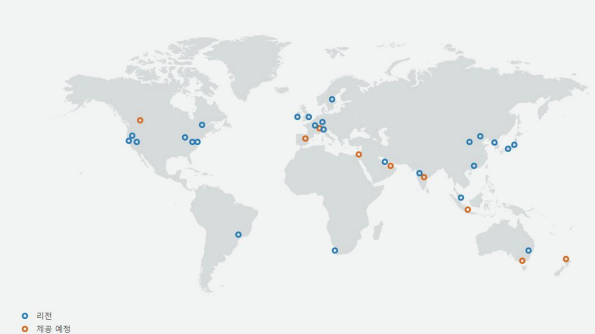
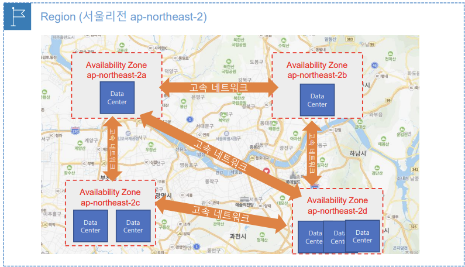
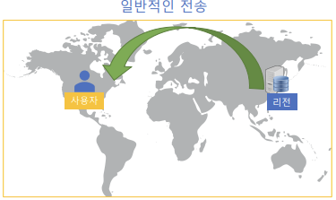
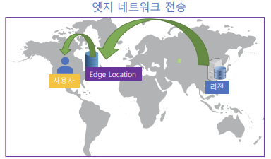
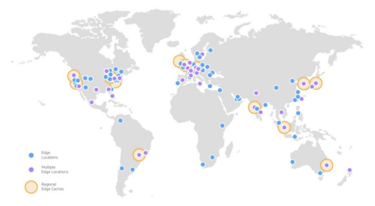

# Section 01 - AWS 시작하기

# AWS 비용 관리

## [AWS Budgets](https://us-east-1.console.aws.amazon.com/billing/home?region=us-east-1#/budgets/overview) - 예산

- 예산을 지정해 비용과 사용량을 추적하는 서비스
- 비용 또는 사용량이 사용자가 지정한 임계값을 초과 할 때 이메일, Amazaon SNS, AWS Chatbot Alerts 등으로 알림을 받거나 RDS/EC2 등의 서비스를 중지하는 작업을 연결할 수 있음
- 필터를 사용해 특정 서비스, 리전, 계정, 인스턴스, 태그 등에 대한 예산 설정 가능
    - AWS 리소스에 태그 값을 지정하여 특정 태그에 대한 리소스만 예산 설정 가능

## [AWS Cost Explorer](https://us-east-1.console.aws.amazon.com/costmanagement/home#/cost-explorer?chartStyle=STACK&costAggregate=unBlendedCost&endDate=2024-05-31&excludeForecasting=false&filter=%5B%5D&futureRelativeRange=CUSTOM&granularity=Monthly&groupBy=%5B%22Service%22%5D&historicalRelativeRange=LAST_6_MONTHS&isDefault=true&reportName=%EC%83%88%20%EB%B9%84%EC%9A%A9%20%EB%B0%8F%20%EC%82%AC%EC%9A%A9%EB%9F%89%20%EB%B3%B4%EA%B3%A0%EC%84%9C&showOnlyUncategorized=false&showOnlyUntagged=false&startDate=2023-12-01&usageAggregate=undefined&useNormalizedUnits=false) - 비용 탐색기

- AWS 서비스에 대한 비용 및 사용량을 시각적으로 분석하는 서비스
- 서비스별, 계정별 등의 그룹화 기준으로 시간별, 일별, 월별 사용량 및 비용을 확인하여 보고서 생성 및 파일로 다운로드 가능
- 최대 지난 12개월간의 데이터를 보고, 이후 12개월 동안 지출할 것으로 예상되는 금액을 예측 가능
- 보고서 매개 변수를 지정한 다음에 csv 파일로 다운로드 가능
- ‘보고서 라이브러리에 저장’을 통해 보고서 저장 가능

## [AWS Cost and Usage Report (CUR)](https://us-east-1.console.aws.amazon.com/billing/home#/reports) - 비용 및 사용 보고서

- AWS 비용 및 사용에 대한 가장 상세한 보고서를 제공하는 서비스
- 리소스, 태그별로 비용을 분류한 보고서를 시간별, 일별, 원별로 생성가능
- 리포트를 활성화한 해당월부터 보고서를 데이터로 수집 가능
- 생성된 보고서 파일을 Amazon S3버킷으로 전송 가능
- 분석을 위해 보고서를 Amazon Athena, Amazon Redshift, Amazon QuickSight와 통합 가능
- ZIP 파일로 다운 받아 csv파일로 자세한 데이터 받아볼 수 있음 
(어떤 서비스에 어떤 리소스가 얼마 만큼의 비용을 사용했는지 상세한 보고서를 받을 수 있음)

# AWS 글로벌 인프라의 이해

- 리전 : 가용영역 위에 존재
- 가용영역 : 하나 이상의 데이터 센터의 모음
- 엣지 네트워크

## 리전 - Region

- AWS는 전 세계 수십개의 지리적 리전에 가용영역을 운영 중
- 데이터 센터가 모여진 물리적 위치
- 여러 개의 데이터 센터를 클러스터링 하는 물리적 위치 (서울 리전, 홍콩 리전 등)
- 전세계 주요 국가에 위치
- **1개 AWS 리전** = **2개 이상의 가용영역**으로 구성
- 대부분의 AWS 서비스는 리전을 선택하여 시작 (예, EC2 서비스)
    - 리전을 선택하지 않는 글로벌 서비스도 있음(예, IAM 서비스)
- 재해복구(DR) 설계 = 2개 이상의 리전에 시스템을 배치

## 가용 영역 (Availability Zone - AZ)

- 가용 영역 = 하나 이상의 개별 데이터 센터
    - 물리적인 하나 이상의 개별 데이터 센터
- 1개의 리전은 2개이상의 가용영역으로 구성 (보통 3~4개의 가용영역으로 구성)
- 가용영역끼리는 물리적으로 떨어져 있고 고속 네트워크로 연결됨
- 가용 영역을 이요해 고가용성 설계 가능
    - 고가용성 설계 = 다중 AZ (Multi-AZ), 2개이상의 가용영역에 시스템 배치
    - 예, 가용영역 A에 EC2 서버를 배치, 가용영역 D에 EC2서버를 배치 → A에 문제가 생겨도 D에 있는 데이터 센터에 있는 서버로 서비스를 지속 가능

⇒ ***하나의 리전은 하나 이상의 데이터 센터로 구성된 2개 이상의 가용 영역으로 구성*** 

## 엣지 로케이션 (Edge Location)

- 데이터 센터 안에 있는 물리적인 서버
- 엣지 로케이션에 콘텐츠(데이터)를 캐싱하여 사용자에게 더 짧은 지연 시간으로 콘텐츠를 전송

| 일반적인 전송                                             |엣지 네트워크 전송|
|-----------------------------------------------------|---|
|                ||
| 속도가 느림  1. 사용자가 콘텐츠를 요청하면 서버가 있는 리전의 오리진에서 전송 |엣지 로케이션은 사용자 근처에 존재 가까운 거리에서 데이터를 받아오므로 사용자가 빠른 속도로 데이터를 받아오게 됨  1. 사용자가 콘텐츠를 최초 요청하면 서버가 있는 리전의 오리진에서 사용자와 가까운 Edge Location으로 전송 2. 사용자는 지리적으로 가까운 Edge Location에서 콘텐츠 전송 3. 사용자가 이후 동일한 콘텐츠를 요청하면 Edge Location에서 콘텐츠 전송(캐싱)  오리진에서 데이터를 받아오지 않고 엣지 로케이션에서 받아오므로 더 빠르게 데이터를 전송받을 수 있음|

- 글로벌 배포서비스인 AWS CloudFront, Global Accelerator에서 대표적으로 사용
- 전세계 수백개의 엣지 로케이션을 운영 중
    - 아프리카 지역은 리전이 없지만 엣지 로케이션은 운영하고 있음
    - 사용자와 가까운 엣지 로케이션에서 사용자가 콘텐츠를 전송받게 되면 리전에서 받아오는 것보다 더 빠른 속도로 전송받을 수 있음
- 엣지로케이션과 AWS 리전, 가용영역끼리는 고속 네트워크로 연결되어 있음
    - 빠른 속도로 데이터를 전송

