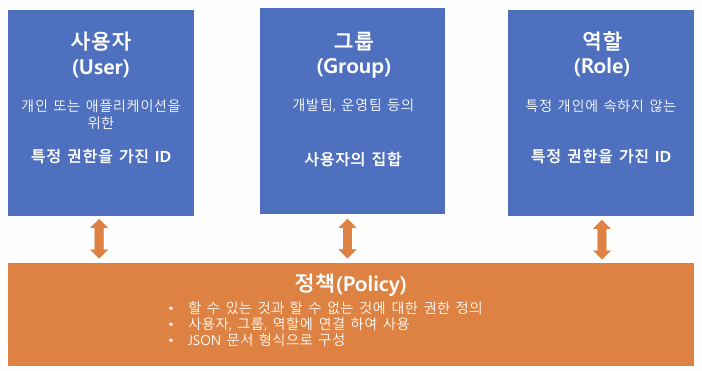
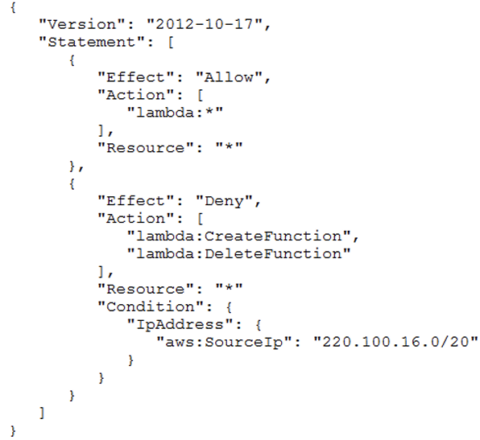
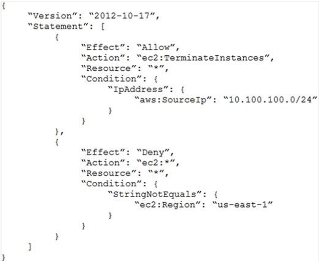
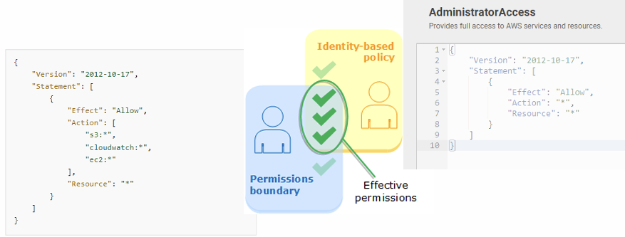
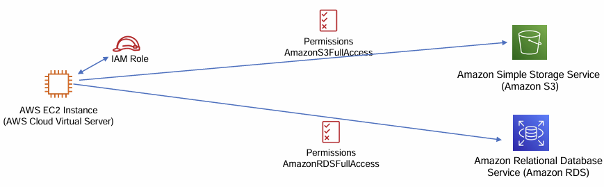
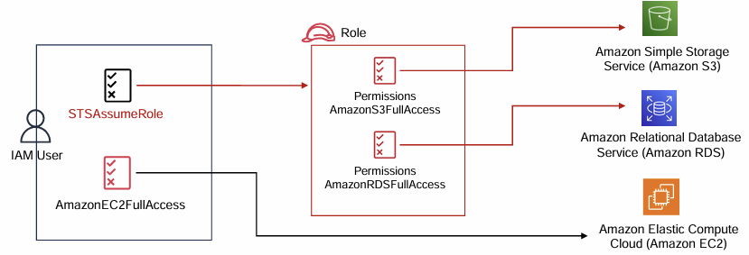
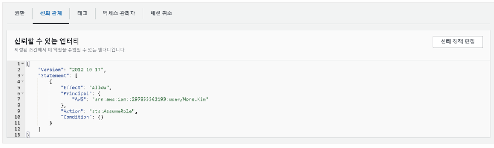
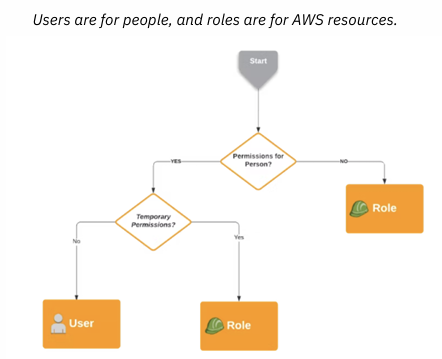

# Section02 - AWS Identity and Access Management (IAM)

# IAM

- AWS 계정 및 권한 관리 서비스
- AWS 서비스와 리소스에 대한 액세스 관리
- 사용자, 그룹, 역할, 정책으로 구성
- 리전에 속하는 서비스가 아닌 글로벌 서비스
    - IAM에서 계정을 만들면 리전에 상관없이 공통적으로 사용 가능
- 계정 보안 강화를 위한 권장 사항
    - 루트 계정(AWS회원가입시 만들어지는 계정)은 최초 사용자 계정 생성 이후 가능하면 사용하지 말 것
    - 사용자 계정(IAM 계정)으로 서비스를 사용하고 사용자는 필요한 최소한의 권한만 부여(최소권한의 원칙)
    - 루트계정과 개별 사용자 계정에 강력한 암호 정책과 멀티팩터 인증(MFA) 적용
    - 사용자의 암호에 대한 복잡성 요구 사항과 의무 교체 주기를 정의 
    사용자 암호에 대한 복잡성을 구성하고 60일마다 또는 90일마다 패스워드 교체 주기를 권장

# IAM 자격증명 - 사용자, 그룹, 역할, 정책



사용자 = 한 사람의 개인<br>
역할 = 한 사람의 개인에 속하지 않고 누구에게나 할당할 수 있는 아이디 

## IAM 사용자

- **단일 개인** 또는 **애플리케이션**에 대한 특정 권한을 가지고 있는 AWS 계정 내 자격 증명
- 한 사람과만 연관 (한 명의 실제 사용자)
- 암호 또는 액세스 키와 같은 장기 자격 증명을 통해 액세스
- id, pw를 통한 콘솔 로그인, 액세스키를 이용한 프로그래밍 방식 로그인, SSH 퍼블릭 , Git 자격 증명, Amazon Keyspaces 자격증명 등으로 로그인 가능


## IAM 정책

- AWS 리소스에 대한 액세스 권한을 정의 한 것
- 사용자, 그룹, 역할에 정책을 연결하여 사용
- JSON 문서 형식으로 이루어짐
- 정책이 명시되지 않는 경우 기본적으로 모든 요청이 거부됨

```json
// IAM 정책 JSON 문서 구조 
{
	"Statement":[{
			"Effect":"effect",
			"Action":"action",
			"Resource":"arn",
			"Condition":{
				"condition":{
					"key":"value"
					}
				}
			}
		}
	]
}
```

| 항목 | 설명 |
| --- | --- |
| Effect | Allow 또는 Deny를 사용하여 명시된 정책에 대해 액세스 허용 또는 거부 |
| Action | 정책이 허용하거나 거부하는 작업 목록 |
| Resource | 작업이 적용되는 리소스 |
| Condition | 정책이 적용되는 세부 조건 (옵션) |

<details><summary> IAM - JSON 정책 구문</summary>

|  | <div style="text-align: left"><ul><li> Lambda 서비스에 대한 정책이 명시<li>기본적으로 모든 권한을 허용<li>220.100.16.0/20 IP 네트워크로 부터의 함수 생성과 함수 삭제는 권한이 거부 됨</ul> </div> |
|----------------------------------------|----------------------------------------------------------------------------------------------------------------------------------------------------|

|  |<div style="text-align: left"><ul><li>EC2 서비스에 대한 정책이 명시<li>사용자 소스 IP 대역이 10.100.100.0/24 인 경우에만 ec2인스턴스를 종료할 수 있음<li>“StringNotEquals” : us-esast-1 리전이 아닌 경우에는(다른 리전에서 발생하는) 모든 작업이 거부 됨</li></ul><br>⇒ 사용자 소스 IP 가 10.100.100.0/24 대역인 경우에만 us-east-1리전의 ec2인스턴스를 종료할 수 있음</div>|
|----------------------------------------|---|

</details>

### IAM - 자격 증명 기반 정책

> 관리형 정책 
>- AWS 계정에 속한 **다수**의 사용자, 그룹 및 역할에 연결할 수 있는 정책
>>- **AWS 관리형 정책** : AWS에서 생성 및 관리
>>- **고객 관리형 정책** : 사용자가 생성 및 관리

> 인라인 정책
>- **단일** 사용자, 그룹 또는 역할에 **직접 추가**하는 정책

### IAM - 권한 경계 (Permission Boundary)

- IAM 사용자 또는 역할에 **최대 권한을 제한** 하는 기능
- **AWS 전체 권한을 가지고 있어도 권한 경계에 대한 권한 범위로 축소되어 적용 됨**
    

    

## IAM 역할

- 특정 권한을 가지고 있는 AWS 계정 내 자격 증명
- AWS 자격 증명이라는 점에서 IAM 역할은 IAM 사용자와 유사
- 역할은 **한 사람과만 연관되지 않고** 해당 역할이 필요한 IAM 사용자, 애플리케이션, AWS 서비스 등 누구든지 맡을 수 있음
- 역할에는 암호 또는 액세스 키와 같은 장기 자격 증명이 없고 해당 역할 세션을 위한 **임시 보안 자격 증명이 제공**
- AWS Security Token Service(**AWS STS**)를 사용해 AWS 리소스에 대한 액세스를 제어할 수 있는 임시 보안 자격 증명을 생성
- IAM 역할을 맡는 경우 발급되는 토큰은 **일시적**이며 만료되면 보안 인증 정보가 유출되고 재사용되는 것과 관련된 위험이 줄어듬
- 역할을 사용하여 AWS 리소스에 액세스할 수 없는 **사용자**, **애플리케이션** 또는 **서비스**에 액세스 권한을 위임

<details>
<summary>사용 예</summary>

- AWS 계정의 사용자(IAM 사용자)에게 권한이 없는 리소스에 대한 액세스 권한을 부여
  - 한 AWS 계정의 사용자에게 다른 계정의 리소스에 대한 액세스 권한을 부여
  - 모바일 앱에서 AWS 리소스를 사용할 수 있도록 하되 앱에 AWS 키를 내장(교체하기 어렵고 사용자가 추출할 가능성이 있음)하길 원치 않는 경우
  - 기업 디렉터리에서처럼 AWS 외부에 정의된 자격 증명을 이미 보유하고 있는 사용자에게 AWS 액세스 권한을 부여
  - 타사에 계정에 대한 액세스 권한을 부여하여 리소스에 대한 감사를 수행할 수 있도록 해야 할 경우

</details>

### IAM - 역할 사용 주체

- AWS 서비스(예: Amazon EC2)
- 역할과 동일하거나 다른 AWS 계정의 IAM 사용자
- Amazon, Facebook 또는 Google과 같은 제3자 웹 자격증명 공급자의 사용자
    - 페이스북이나 구글 계정으로 AWS 서비스에 액세스 가능
- SAML 2.0 등과 호환되는 외부 자격 증명 공급자(IdP) 서비스에 의해 인증된 외부 사용자
    - 기업의 디렉토리 서비스(SAML 2.0)의 디렉토리의 계정을 통해서 기업에서 관리하는 id, pw에 역할을 부여해서 AWS 서비스에 액세스 가능

### IAM – 역할이 사용되는 시나리오 (AWS 서비스에 대한 액세스 권한 부여)

- **AWS 리소스**에서 사용하는 자격증명
- 특정 AWS 서비스가 다른 AWS 서비스에 액세스 하여 작업을 수행할 때 필요한 권한
<details><summary>예, EC2에서 실행되는 애플리케이션이 AWS S3와 AWS RDS 액세스 권한이 필요할 때 역할 사용</summary>

- ec2 서버에 애플리케이션이 운영된다고 가정
- ec2의 인스턴스에 있는 애플리케이션이 다른 서비스(s3, RDS)에 접속해서 여러가지 작업을 하기 위해서는 ….
- 기본적으로는 접속을 할 수 없음
- 역할을 통해서 권한을 받아와야 함
- ec2 인스턴스의 역할을 연결을 하면 이 역할에 연결된 정책들이 있음
    - 아마존의 s3 full access 정책 이 역할(IAM Role)에 연결되어 있음
    - RDS full access 정책이 역할에 연결되어 있음
- 이 역할을 ec2 인스턴스에 할당을 하게 되면 이 ec2 인스턴스는 s3나 rd에 액세스해서 작업을 수행 할 수 있음
</details>


    

### IAM – 역할이 사용되는 시나리오 (IAM 사용자에게 역할 부여)

IAM 사용자에게 정책을 연결해서 AWS 서비스 액세스 하는 것이 아닌 IAM 사용자에게 역할을 부여해서 AWS 리소스에 대한 액세스를 할 수 있도록 하는 것 

유저에 직접 정책을 연결하는 방법 = 장기 자격 증명

**STS (임시토큰) = 임시 자격 증명** 

- **동일한 AWS 계정**의 IAM 사용자에게 역할 부여
- **다른 AWS 계정**의 IAM 사용자에게 역할 부여(교차 계정 액세스)
- 예,
    - 역할을 만들고 이 역할에 정책을 연결
    - 이 정책을 STS(임시 토큰 서비스) Assume role을 통해 IAM 유저와 연결
    - IAM 유저가 역할을 통해서 S3 서비스, RDS 서비스에 액세스할 수 있는 권한을 갖게 됨
    
    
    
- 부여된 역할 사용 방법
    - IAM 콘솔을 사용하는 계정의 IAM 사용자가 역할을 전환하여 콘솔에서 해당 역할의 권한을 **임시로 사용**
    - 사용자는 자신의 원래 권한을 포기하고 역할에 할당된 권한을 **수임**
    - 사용자가 역할을 끝내면 원래 권한이 **복원**

### IAM - 역할 (신뢰정책)

- IAM 역할에 대한 리소스 기반 정책
- 역할을 맡을 수 있는 **보안 주체**와 **조건**을 정의
<details><summary>정책 예</summary>
    

  
- 역할을 만들 때 신뢰 정책을 생성, JSON 형식, 정책과 구조가 동일
- sts:AssumeRole권한이 있는 보안 주체(297853362193 AWS 계정의 IAM사용자 Mone.Kim)이 역할을 맡을 수 있음
    - arn : aws 리소스 네임
    - 보안 주체 : arn으로 시작되는 aws 리소스 네임
- 시간기반, IP기반등으로 사용을 제한할 수도 있음
    - 특정 기간에만 액세스가 가능하도록, 특정 ip만 액세스가 가능하도록 사용을 제한할 수 있음
</details>

### IAM - 사용자(User) vs 역할(Role)

|| <div style="text-align:left"><ul><li> User는 사람을 위한 것 (한 사람)<li>Role은 AWS 리소스를 위한 것 <li>사람을 위한 권한이 아니면 **역할**을 부여<ul> <li>ec2 인스턴스가 aws 리소스에 접속을 하려면 역할을 써야 함</ul><li>사람을 위한 권한이고 teporary permission(임시 액세스 권한)을 줄 거면 **역할**을 사용(권한을 줬다가 다시 회수할 경우)<li>사람을 위한 권한이고 장기적인 액세스를 제공할 경우에는 **IAM 사용자** 사용<ul> </div> |
|---|-----------------------------------------------------------------------------------------------------------------------------------------------------------------------------------------------------------------------------------------------------------------------------------------------------------------|

# IAM 보안 도구(IAM Security Tools)

> [IAM 자격증명 보고서 (Credentials Report)](https://us-east-1.console.aws.amazon.com/iam/home#/credential_report)
>- 계정의 모든 사용자와 암호, 액세스 키, MFA 디바이스 등의 자격 증명 상태에 대한 보고서를 다운로
드

> IAM 액세스 관리자 (Access Advisor)
>- 사용자 또는 역할이 허용된 서비스에 마지막으로 액세스하려고 시도한 시간을 표시
>- 이 정보를 사용해 필요이상으로 부여된 권한을 재정의 하는데 참고 가능


# [IAM Policy Simulator](https://policysim.aws.amazon.com/)

AWS 계정의 IAM 사용자, 그룹 또는 역할에 연결된 정책을 테스트

